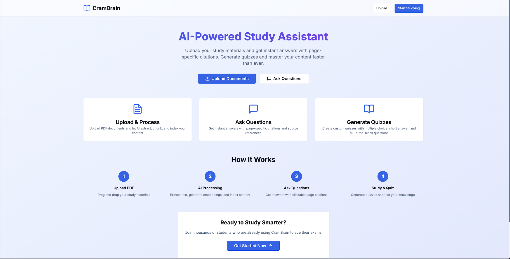

# CramBrain



**Goal:** Accessible web app for uploading notes/slides, asking grounded questions with per-page citations, and generating quizzes.

## Live Demo Checklist

After deployment, verify these features work:

- [ ] Visit `/upload` → drag-drop PDF → see processing status
- [ ] Visit `/chat` → ask questions → see `[p.N]` citations
- [ ] Click citation → opens PDF viewer at exact page
- [ ] Visit `/quiz` → generate 10 questions → reveal answers
- [ ] All citations link to correct pages with highlights

## Quick Start (Deploy Today)

### Option 1: One-Click Deploy (Recommended)

1. **Fork this repository** to your GitHub account
2. **Deploy API to Render:**
   - Go to [render.com](https://render.com) → New → Web Service
   - Connect GitHub → Select this repo → Choose `apps/api` folder
   - Add environment variables (see table below)
   - Enable persistent disk: `/data` (1GB minimum)
   - Click Deploy

3. **Deploy Web to Vercel:**
   - Go to [vercel.com](https://vercel.com) → Import Project
   - Select GitHub repo → Choose root directory (not apps/web)
   - Set `NEXT_PUBLIC_API_BASE_URL` to your Render API URL
   - Click Deploy

### Option 2: CLI Deploy (No Git Required)

```bash
# Deploy API to Render
npm install -g @render/cli
render auth login
render services create --name crambrain-api --type web --dockerfile apps/api/Dockerfile --region oregon

# Deploy Web to Vercel
npm install -g vercel
vercel --prod
```

### Option 3: Local Development

```bash
# Clone and setup
git clone <your-repo-url>
cd cram-brain

# Copy environment file
cp env.example .env
# Edit .env with your values (REQUIRED)

# Install dependencies
make install

# Start API (Terminal 1)
make dev-api

# Start Web (Terminal 2)
make dev-web

```

## Architecture

- **Frontend:** Next.js 14 (App Router) + TypeScript + Tailwind + shadcn/ui → **Vercel**
- **API:** FastAPI (Python 3.11) + Uvicorn → **Render** (Docker)
- **Vector DB:** Chroma (v1) persisted to `/data/chroma`
- **Storage:** S3-compatible (Cloudflare R2 recommended)
- **Parsing:** PyMuPDF + Tesseract OCR fallback
- **Embeddings:** sentence-transformers/all-MiniLM-L6-v2 (local)
- **LLM:** OpenAI gpt-4o-mini with strict grounding

## Project Structure

```
cram-brain/
├── app/                     # Next.js App Router (frontend)
│   ├── (marketing)/page.tsx
│   ├── upload/page.tsx
│   ├── chat/page.tsx
│   ├── docs/[docId]/page.tsx
│   └── quiz/page.tsx
├── components/              # React components
├── lib/                     # Frontend utilities
├── apps/
│   └── api/                 # FastAPI on Render
│       ├── src/
│       │   ├── main.py
│       │   ├── routers/
│       │   │   ├── chat.py
│       │   │   ├── documents.py
│       │   │   ├── ingest.py
│       │   │   └── quiz.py
│       │   ├── core/
│       │   ├── rag/
│       │   ├── models/
│       │   └── utils/
│       ├── Dockerfile
│       ├── requirements.txt
│       └── render.yaml
├── scripts/
├── docker-compose.dev.yml
├── .env.example
├── Makefile
└── README.md
```

## Environment Variables

### Required for Both Platforms

| Variable | Platform | Description | Example |
|----------|----------|-------------|---------|
| `NEXT_PUBLIC_API_BASE_URL` | Vercel | Your Render API URL | `https://crambrain-api.onrender.com` |
| `OPENAI_API_KEY` | Render | OpenAI API key | `your_openai_api_key_here` |

### Render API Environment Variables

| Variable | Description | Example |
|----------|-------------|---------|
| `API_HOST` | API host | `0.0.0.0` |
| `API_PORT` | API port | `8000` |
| `CORS_ORIGINS` | Allowed origins | `https://your-app.vercel.app` |
| `S3_ENDPOINT_URL` | S3-compatible endpoint | `https://your-account.r2.cloudflarestorage.com` |
| `S3_REGION` | S3 region | `auto` |
| `S3_BUCKET` | S3 bucket name | `crambrain-documents` |
| `S3_ACCESS_KEY_ID` | S3 access key | `your-access-key` |
| `S3_SECRET_ACCESS_KEY` | S3 secret key | `your-secret-key` |
| `S3_PUBLIC_BASE_URL` | Public S3 base URL | `https://your-bucket.your-domain.com` |
| `CHROMA_PERSIST_DIR` | Chroma storage path | `/data/chroma` |
| `CHROMA_COLLECTION` | Chroma collection name | `crambrain` |
| `ENABLE_TESSERACT` | Enable OCR fallback | `true` |
| `TESSERACT_CMD` | Tesseract command path | `/usr/bin/tesseract` |
| `OPENAI_MODEL` | OpenAI model | `gpt-4o-mini` |
| `MAX_FILE_MB` | Max file size | `50` |
| `ALLOWED_MIME` | Allowed MIME types | `application/pdf,image/png,image/jpeg` |

### Copy-Paste Environment Blocks

**For Render (API):**
```bash
API_HOST=0.0.0.0
API_PORT=8000
CORS_ORIGINS=https://your-app.vercel.app
S3_ENDPOINT_URL=https://your-account.r2.cloudflarestorage.com
S3_REGION=auto
S3_BUCKET=crambrain-documents
S3_ACCESS_KEY_ID=your-access-key
S3_SECRET_ACCESS_KEY=your-secret-key
S3_PUBLIC_BASE_URL=https://your-bucket.your-domain.com
CHROMA_PERSIST_DIR=/data/chroma
CHROMA_COLLECTION=crambrain
ENABLE_TESSERACT=true
TESSERACT_CMD=/usr/bin/tesseract
OPENAI_API_KEY=your_openai_api_key_here
OPENAI_MODEL=gpt-4o-mini
MAX_FILE_MB=50
ALLOWED_MIME=application/pdf,image/png,image/jpeg
RATE_LIMIT_REQUESTS=100
RATE_LIMIT_WINDOW=3600
```

**For Vercel (Web):**
```bash
NEXT_PUBLIC_API_BASE_URL=https://your-render-app.onrender.com
```

## Deployment

### Option 1: Vercel + Render (Recommended)

#### Deploy API to Render:
1. Go to [render.com](https://render.com) → New → Web Service
2. Connect GitHub repo → Select `apps/api` folder
3. Configure:
   - **Build Command:** `pip install -r requirements.txt`
   - **Start Command:** `uvicorn src.main:app --host 0.0.0.0 --port $PORT`
   - **Environment:** Python 3.11
4. Add environment variables (see table above)
5. Enable persistent disk: `/data` (1GB minimum)
6. Click Deploy

#### Deploy Web to Vercel:
1. Go to [vercel.com](https://vercel.com) → Import Project
2. Select GitHub repo → Choose root directory (not apps/web)
3. Set environment variable: `NEXT_PUBLIC_API_BASE_URL=https://your-render-app.onrender.com`
4. Click Deploy

### Option 2: CLI Deployment (No Git)

#### Deploy API:
```bash
# Install Render CLI
npm install -g @render/cli

# Login
render auth login

# Create service
render services create --name crambrain-api --type web --dockerfile apps/api/Dockerfile --region oregon
```

#### Deploy Web:
```bash
# Install Vercel CLI
npm install -g vercel

# Deploy (from root directory)
vercel --prod
```

## Verification & Testing

### Automated Testing

**Smoke Tests:**
```bash
# Test all endpoints
bash scripts/smoke_test.sh

# Test with custom API URL
API_BASE_URL=https://your-render-app.onrender.com bash scripts/smoke_test.sh
```

**Demo Seed Script:**
```bash
# Upload sample PDF and test complete workflow
bash scripts/seed_demo.sh

# Test with custom API URL
API_BASE_URL=https://your-render-app.onrender.com bash scripts/seed_demo.sh
```

**HTTP Tests (VS Code REST Client):**
```bash
# Open scripts/smoke_test.http in VS Code
# Update @baseUrl with your API URL
# Run individual tests with REST Client extension
```

### Manual Verification

1. **Upload Test:**
   - Visit `/upload` page
   - Drag-drop a PDF file
   - Verify processing completes successfully

2. **Chat Test:**
   - Visit `/chat` page
   - Ask: "What are the main topics covered?"
   - Verify answer contains `[p.N]` citations
   - Click on citations to verify PDF viewer opens

3. **Quiz Test:**
   - Visit `/quiz` page
   - Generate 10 questions
   - Verify questions have page references
   - Test answer reveal functionality

4. **PDF Viewer Test:**
   - Click on any citation
   - Verify PDF opens at correct page
   - Test page navigation and zoom controls

### Expected Outputs

**Successful API Response Examples:**

```json
// Health Check
{
  "status": "ok",
  "time": "2024-01-01T00:00:00Z",
  "services": {
    "chroma": "ok",
    "s3": "ok"
  }
}

// Question Answer
{
  "answer": "This document covers machine learning fundamentals [p.1] and neural networks [p.3]...",
  "citations": [
    {
      "doc_id": "doc-123",
      "page": 1,
      "preview_url": "https://...",
      "quote": "Machine learning is..."
    }
  ]
}

// Quiz Generation
{
  "questions": [
    {
      "type": "multiple_choice",
      "prompt": "What is machine learning?",
      "options": ["A", "B", "C", "D"],
      "answer": "A",
      "page": 1,
      "quote": "Machine learning is..."
    }
  ]
}
```

## Troubleshooting

### Common Issues

**CORS Errors:**
- Set `CORS_ORIGINS=https://your-vercel-app.vercel.app`
- Include custom domain if using one
- Check browser console for specific CORS errors

**403 on S3 Upload:**
- Verify S3 credentials are correct
- Check bucket permissions (public read, authenticated write)
- Ensure CORS configuration on S3 bucket allows your domain

**Tesseract Missing:**
- Ensure `ENABLE_TESSERACT=true` in Render environment
- Check Dockerfile includes tesseract installation
- Verify `TESSERACT_CMD=/usr/bin/tesseract`

**Chroma Path Issues:**
- Verify persistent disk is mounted at `/data`
- Check `CHROMA_PERSIST_DIR=/data/chroma`
- Ensure Render service has persistent disk enabled

**API Not Responding:**
- Check Render service logs for errors
- Verify all environment variables are set
- Test health endpoint: `curl https://your-api.onrender.com/v1/health`

**PDF Processing Fails:**
- Check file size (max 50MB)
- Verify PDF is not password-protected
- Check OCR is enabled for image-heavy PDFs

### Debug Commands

```bash
# Check API health
curl https://your-render-app.onrender.com/v1/health

# Test presign endpoint
curl -X POST https://your-render-app.onrender.com/v1/presign \
  -H "Content-Type: application/json" \
  -d '{"filename": "test.pdf"}'

# Check Render logs
render logs --service your-service-name

# Test local development
docker-compose -f docker-compose.dev.yml logs api
```

## Architecture Details

### Tech Stack
- **Frontend:** Next.js 14, TypeScript, Tailwind CSS, shadcn/ui
- **Backend:** FastAPI, Python 3.11, Uvicorn
- **Vector DB:** Chroma (persistent storage)
- **Storage:** S3-compatible (Cloudflare R2 recommended)
- **AI:** OpenAI GPT-4o-mini, sentence-transformers
- **PDF:** PyMuPDF + Tesseract OCR
- **Deployment:** Vercel (frontend) + Render (backend)

### Key Features
- **Hybrid Search:** BM25 + vector search with RRF fusion
- **Strict Grounding:** All answers include page citations
- **OCR Fallback:** Automatic OCR for image-heavy pages
- **Presigned Uploads:** Direct S3 uploads for scalability
- **Deep Linking:** Citations open PDF viewer at exact page
- **Quiz Generation:** 6 short-answer + 2 MCQ + 2 cloze questions

### API Endpoints
- `GET /v1/health` - Health check
- `POST /v1/presign` - Generate S3 upload URL
- `POST /v1/ingest` - Process uploaded document
- `POST /v1/ask` - Ask questions with citations
- `POST /v1/quiz` - Generate quiz questions
- `GET /v1/docs` - List documents
- `GET /v1/search` - Search documents
